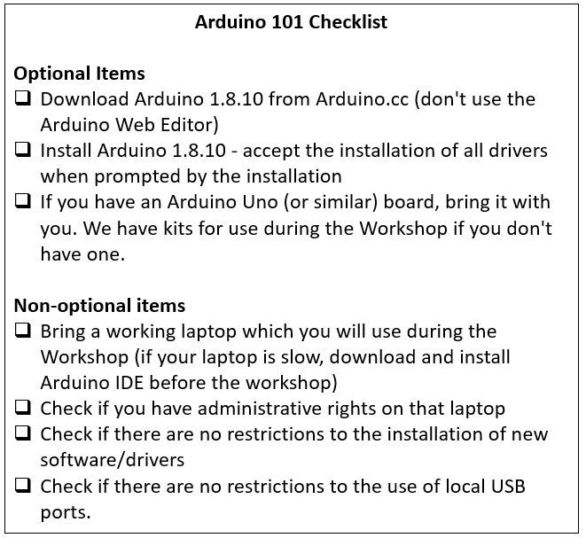

## Arduino 101

Arduino is an open source Hardware, which allows you to write code to control how this hardware will behave. In other words, we can create our own device, to do whatever we want. Isn’t that awesome? Couple of examples of things I built using Arduino boards:

- **Pet door controller**: Arduino controls the motor that opens and closes the pet door at pre-set times.
- **Toastmaster timer**: Handy device to help us at the toastmasters meetings.
- **Temperature monitor**: Real-time dashboard about what is the current temperature and humidity inside and outside my house.

Like any other programming language, we start with the Hello World, but in this case, we write code to make an Led blink. It’s just as simple as seeing the “Hello World” in a computer screen. But if you think through it you’ll realize this is opens a door to infinite possibilities.

When you see something happening in the real world because of the code you wrote, it’s impossible not to feel amazed. From a blinking Led to a line follower robot, it’s all about you, your code and an Arduino board.

This is an amazing opportunity for you! If you’re a software person this is your chance to learn some electronics and how they interact! If you’re an electronics person, this is your chance to get into coding! Even if you don’t know any, it’s still worth trying.

In this introduction we will cover:

- What is Arduino?
- What can we do with it
- How to connect your computer with an Arduino board
- How to wire and control and LED
- How to read events from a button
- How to control a servo motor
- Basic C++ programming

Check Snoco Makerspace Meetup page for the updated schedule: [Meetup](https://www.meetup.com/SnoCo-Makers/events/)

-----

### Workshop Checklist

Review the checklist below before attending the workshop:

