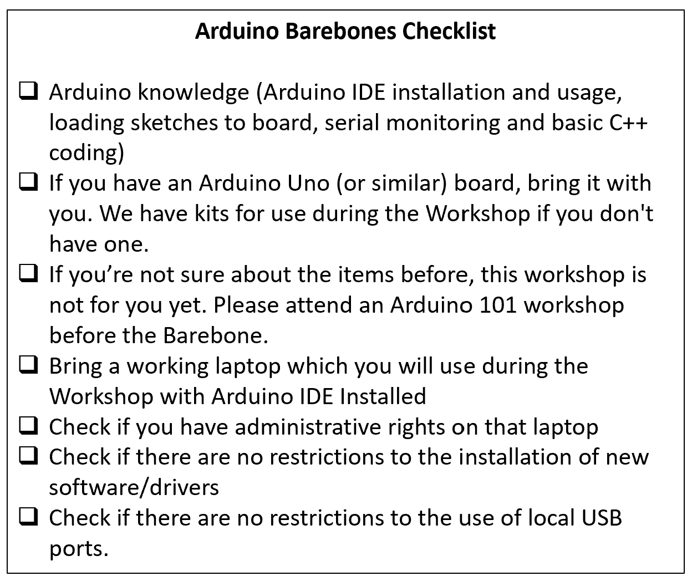

## Arduino Barebones

Have you ever wanted to create your own device using an Arduino microcontroller but without having to rely on the Uno board? 

Arduino Bare Metal workshop is all about taking the ATMega328P microcontroller (Arduino Uno brain) out of the Arduino Uno board, into a breadboard and addint the bare minimum set of components to get it working just like an Arduino.

This will allow you to better understand how a Microcontroller works and will give you the confidence to create your own projects! 

In this workshop we will cover:

- Assemble a bare metal circuit using a breadboard (like the one in the picture)
- Loading the bootloader into the microcontroller chip (DEMO)
- Understand the difference between SPI and UART interfaces (when to use each when interfacing with Microcontrollers to load your sketch)
- Load sketches to your board
- Alternatives for powering your bare metal circuit and tradeoffs
- Debug the circuit and common troubleshooting scenarios

Check Snoco Makerspace Meetup page for the updated schedule: [Meetup](https://www.meetup.com/SnoCo-Makers/events/)

-----

### Workshop Checklist

Review the checklist below before attending the workshop:

