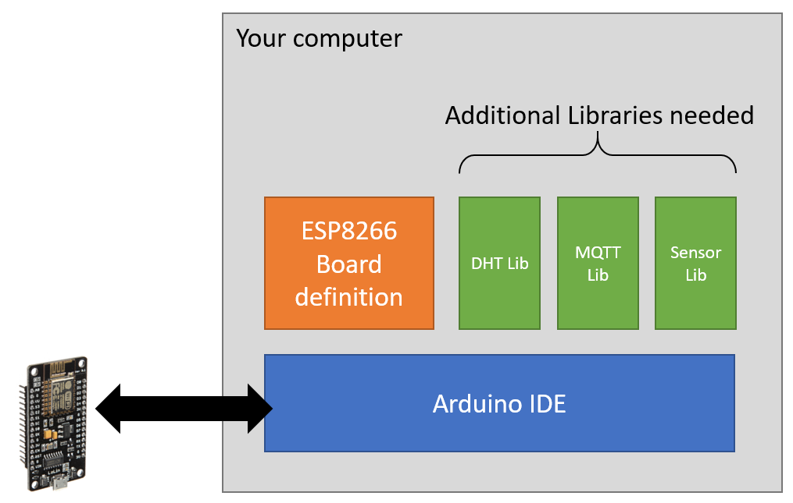
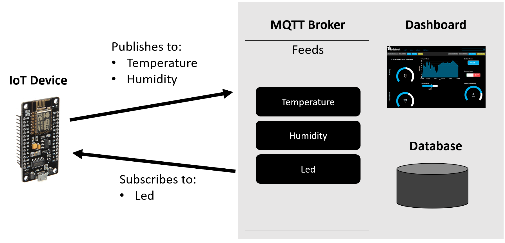
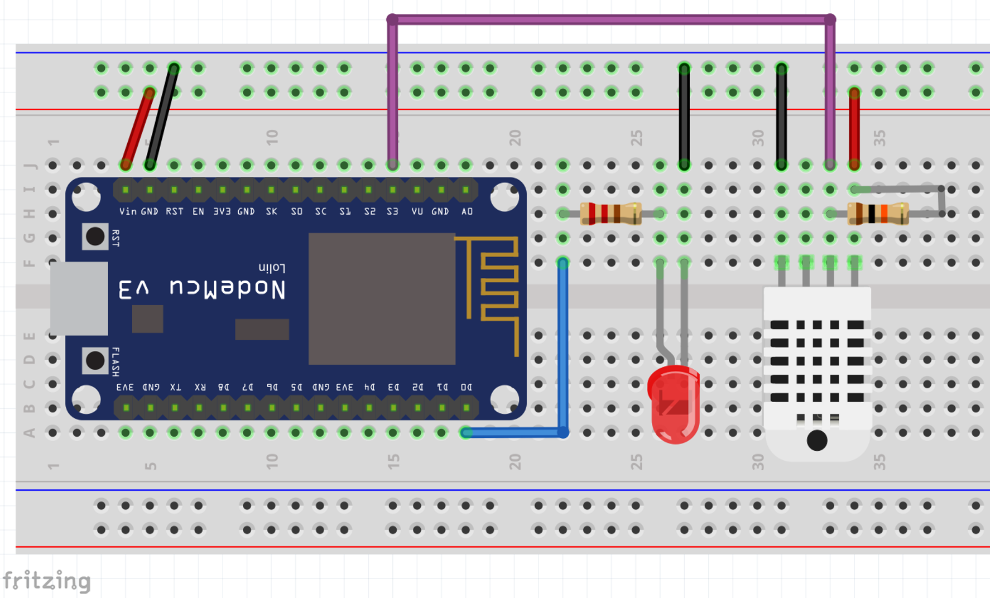

## IoT 101 for Makers

> This page was created to suport the Iot 101 for Makers workshop at the Snoco makerspace.

Iot or Internet of Things has been a hot topic in the IT industry for many years now, and due to the masive availability of low cost / Wi-Fi enabled MCUs Makers or Hobbyists are also taking advantage of this technology for simple automation projects.

This workshop was created to help you take your first step into IoT, and we'll work together to:

- **Setup the Toolchain**: the toolchain required to work with IoT applications is a little different from simpler projects, and we need to ensure the toolchain has been correctly setup before running the samples. 

Use the string below to add the board definition to your Arduino IDE.

```
http://arduino.esp8266.com/stable/package_esp8266com_index.json

```



- **IoT End to End**: the device will be connected to an online service (message broker) that gets the messages published and pushes the messages back to the device and for which the device has been subscribed to.



- **Device**: this workshop leverages a simple ESP8266 Dev Kit like the Node MCU and we'll add a DHT11 (or DHT22) temperature and humidity sensor to the GPIO pin 10 and also a LED to the GPIO pin 16. With this simple setup we can send data and get commands from the online message broker. 



## Testing the Project

Once you get your device and the toolchain setup, it is time to get the code. Copy all code from link below and paste it into a blank project in Arduino IDE.

[IoT 101 code](https://raw.githubusercontent.com/wduraes/Workshops/master/IoT%20101%20for%20Makers/IoT_101_Online/IoT_101_Online.ino)

